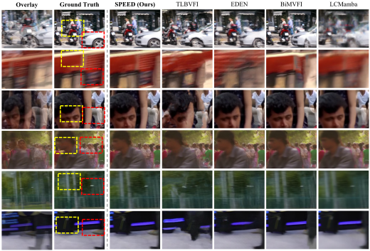
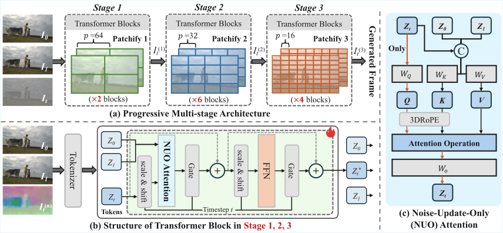

# [ACM MM 2026] SPEED: One-Step Pixel Diffusion for High-quality Video Frame Interpolation

<a href="#"></a>
<a href="#"></a>
<a href="https://bbldCVer.github.io/SPEED/"></a>
<a href="https://github.com/bbldCVer/SPEED"></a>

This repository is the official PyTorch implementation of the following paper:

> **SPEED: One-Step Pixel Diffusion for High-quality Video Frame Interpolation**
>
> Zihao Zhang, Haoyu Zhao, Siqian Yang, Yidi Wu, Yudong Jiang, Zuxuan Wu

<div align="center">
  
</div>

## Pipeline

<div align="center">
  
</div><br/>

We introduce SPEED, a one-step pixel diffusion framework for high-quality video frame interpolation. Unlike previous latent diffusion VFI methods, SPEED performs denoising directly in the RGB pixel space, avoiding VAE-induced detail loss while bypassing expensive iterative sampling.

Our framework adopts a progressive multi-stage Transformer with dynamic patch scaling from `64 -> 32 -> 16`, enabling a macroscopic-to-microscopic generation process that first captures large-scale motion, then refines structural alignment, and finally synthesizes fine-grained textures. We further introduce Noise-Update-Only (NUO) Attention to update only the noisy target-frame tokens while preserving clean condition-frame semantics, and Drift-aware Timestep Sampling (DTS) with direct clean-frame prediction to enable high-quality one-step inference.

<div align="center">
  
</div><br/>

<div align="center">
  
</div>

## Quick Start

### Clone the Repository

```bash
git clone https://github.com/bbldCVer/SPEED.git
cd SPEED
```

### Prepare Environment

We recommend Python 3.10 and a CUDA GPU environment. SPEED depends on `xformers`, `cupy`, and the CUDA correlation kernel used by FloLPIPS/PWCNet.

```bash
conda create -n speed python=3.10 -y
conda activate speed
pip install --upgrade pip

# Install PyTorch wheels matching your CUDA environment.
# CUDA 12.1 example:
pip install torch torchvision --index-url https://download.pytorch.org/whl/cu121

pip install -r requirements.txt
```

For CUDA 11 environments, replace `cupy-cuda12x` in `requirements.txt` with `cupy-cuda11x`. `xformers` must also match your PyTorch/CUDA version.

Before running training, evaluation, or inference, set:

```bash
export PYTHONPATH="${PWD}:${PWD}/src/utils:${PYTHONPATH}"
```

The first run may download pretrained AlexNet, VGG, PWCNet, LPIPS, or DISTS-related weights. For offline environments, prepare the corresponding PyTorch and torch hub caches in advance.

## Prepare Datasets

All dataset adapters return triplets in the following order:

```text
[frame_0, frame_1, gt]
```

`frame_0` and `frame_1` are endpoint frames, and `gt` is the ground-truth intermediate frame. Inputs are read in `[0, 255]` and normalized to `[-1, 1]` by the trainer.

Please prepare datasets according to the following structure.

```text
<data directory>/
├── LAVIB/
│   ├── annotations/
│   │   ├── train.csv
│   │   └── ...
│   ├── segments/
│   │   ├── <name>_shot<shot>_<tmp_crop>_<vrt_crop>_<hrz_crop>/
│   │   │   └── frames/
│   │   │       ├── 001.jpg
│   │   │       └── ...
│   │   └── ...
│   └── segments_downsampled_256/
│       ├── <name>_shot<shot>_<tmp_crop>_<vrt_crop>_<hrz_crop>/
│       │   └── vid.mp4
│       └── ...
├── DAVIS/
│   └── <video_name>/
│       └── <triplet_name>/
│           ├── frame_0.jpg
│           ├── frame_1.jpg
│           └── frame_2.jpg
├── snu_film/
│   ├── test/
│   │   └── <paths referenced by test-*.txt>
│   ├── test-easy.txt
│   ├── test-medium.txt
│   ├── test-hard.txt
│   └── test-extreme.txt
└── X4K1000FPS/
    └── test/
        ├── Type1/<sequence>/0000.png
        ├── Type1/<sequence>/0016.png
        ├── Type1/<sequence>/0032.png
        ├── Type2/<sequence>/...
        └── Type3/<sequence>/...
```

Notes:

- LAVIB annotations must contain `name`, `shot`, `tmp_crop`, `vrt_crop`, and `hrz_crop`.
- When LAVIB `height <= 256`, the loader reads `segments_downsampled_256/.../vid.mp4`; otherwise it reads image frames from `segments/.../frames/*.jpg`.
- DAVIS uses `frame_0.jpg` and `frame_2.jpg` as inputs, and `frame_1.jpg` as the intermediate ground truth.
- SNU-FILM uses the list file selected by `mode`, such as `test-extreme.txt`.
- XTest uses `0000.png`, `0032.png`, and `0016.png` as the two input frames and middle frame.

## Download Checkpoints

Pretrained checkpoints will be released soon. After downloading, place them under:

```text
checkpoints/
└── speed.pt
```

The current code expects checkpoints saved as:

```python
{"model": model_state_dict, ...}
```

## Inference

SPEED performs one-step interpolation. It supports image-pair interpolation and video interpolation.

### Image Pair

```bash
export PYTHONPATH="${PWD}:${PWD}/src/utils:${PYTHONPATH}"
python inference.py \
  --config configs/eval_config.yaml \
  --pretrained_path checkpoints/speed.pt \
  --frame0 examples/frame_0.png \
  --frame1 examples/frame_1.png \
  --output interpolation_outputs/interpolated.png \
  --device cuda:0 \
  --precision bf16
```

### Video

Parallel video interpolation batches adjacent frame pairs for higher throughput:

```bash
python inference.py \
  --config configs/eval_config.yaml \
  --pretrained_path checkpoints/speed.pt \
  --input_video examples/input.mp4 \
  --output interpolation_outputs/interpolated_parallel.mp4 \
  --video_mode parallel \
  --batch_size 4 \
  --precision bf16
```

Sequential video interpolation processes one adjacent frame pair at a time and is more memory-friendly:

```bash
python inference.py \
  --config configs/eval_config.yaml \
  --pretrained_path checkpoints/speed.pt \
  --input_video examples/input.mp4 \
  --output interpolation_outputs/interpolated_sequential.mp4 \
  --video_mode sequential \
  --precision bf16
```

By default, the output FPS is doubled to preserve the original video duration after inserting intermediate frames. Use `--keep_fps` to keep the input FPS, or `--fps 60` to set a custom output FPS.

## Evaluation

Modify `configs/eval_config.yaml` before evaluation:

```yaml
pretrained_path: checkpoints/speed.pt
dataset_name: "DAVIS"
dataset_args:
  DAVIS:
    data_dir: /path/to/DAVIS
    height: 480
    width: 854
    is_val: true
output_dir: /path/to/outputs
```

Then run:

```bash
export PYTHONPATH="${PWD}:${PWD}/src/utils:${PYTHONPATH}"
python eval.py --config configs/eval_config.yaml
```

For multi-GPU evaluation:

```bash
accelerate launch --num_processes 8 eval.py --config configs/eval_config.yaml
```

Evaluation reports PSNR, SSIM, LPIPS, FloLPIPS, and L1. If `visualize: true`, input frames, ground truth, and predicted frames are saved to the experiment directory.

## Training

Modify `configs/train_config.yaml` before training:

```yaml
dataset_name: "LAVIB"
val_dataset_name: "SNU_FILM"
dataset_args: ...
output_dir: /path/to/outputs
experiment_name: speed
epochs: 100
base_lr: 1e-04
validate_metric: "LPIPS"
```

Single-machine training:

```bash
export PYTHONPATH="${PWD}:${PWD}/src/utils:${PYTHONPATH}"
python train.py --config configs/train_config.yaml
```

Multi-GPU training:

```bash
accelerate launch --num_processes 8 train.py --config configs/train_config.yaml
```

Multi-node training can use `configs/accelerate_config.yaml`. Update `num_machines`, `num_processes`, `machine_rank`, `main_process_ip`, and `main_process_port` according to your cluster.

Training logs use SwanLab. For online logging:

```bash
swanlab login -k "Your SwanLab Key"
```

If SwanLab is unreachable, the code falls back to local mode.

## Output Structure

Training and evaluation create timestamped experiment directories:

```text
<output_dir>/<experiment_name>/<YYYYMMDD_HHMMSS>/
├── checkpoints/
│   └── best.pt
├── visualization_results/
├── validation_results/
├── log.txt
└── eval_results.json
```

`checkpoints/best.pt` is saved when the validation metric improves. For `validate_metric`, LPIPS, FloLPIPS, and L1 are lower-is-better; PSNR and SSIM are higher-is-better.

## BibTeX

```bibtex
@inproceedings{zhang2026speed,
  title={SPEED: One-Step Pixel Diffusion for High-quality Video Frame Interpolation},
  author={Zhang, Zihao and Zhao, Haoyu and Yang, Siqian and Wu, Yidi and Jiang, Yudong and Wu, Zuxuan},
  booktitle={Proceedings of the ACM International Conference on Multimedia},
  year={2026}
}
```

## Acknowledgement

This repository includes the FloLPIPS implementation and uses PyTorch, Accelerate, xFormers, LPIPS, DISTS, and SwanLab. We thank the authors and maintainers of these projects for their open-source contributions.
